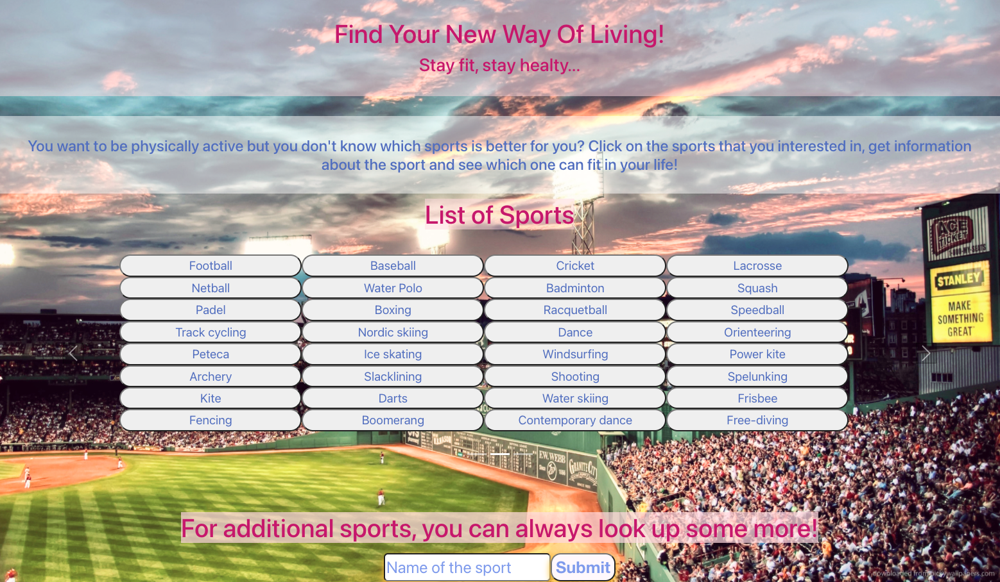
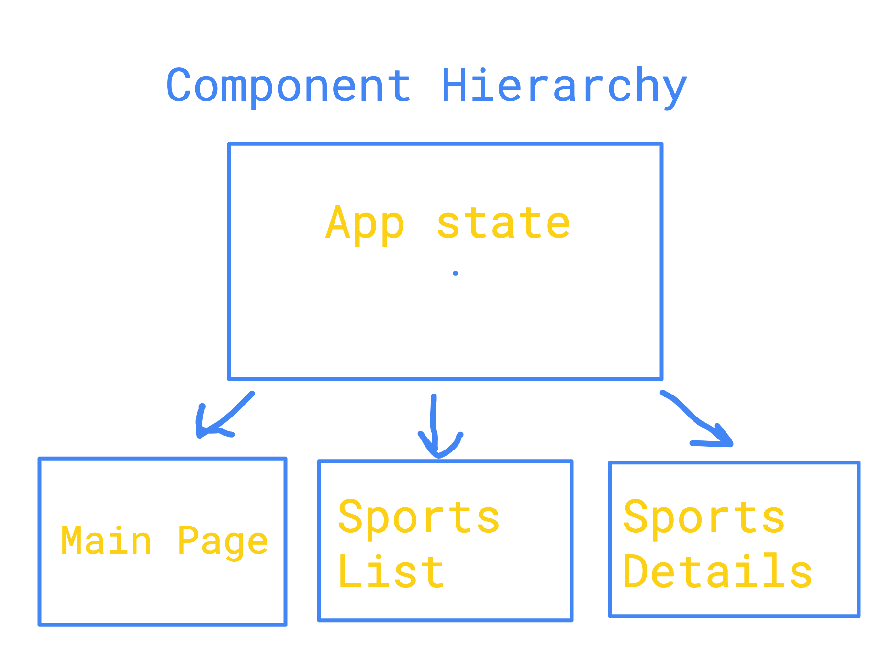
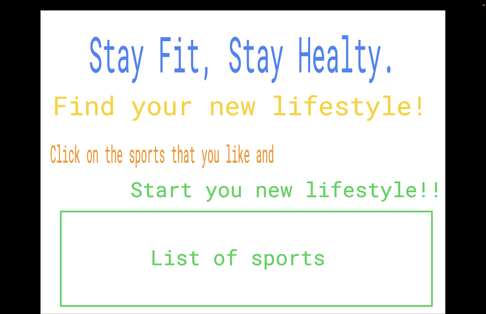

<h1>SportsForLife</h1>
🚵🏻‍♂️Welcome to SportsForLife App🚵🏻‍♂️

You can choose a sport, get information about the sport and start changing your life!

<h2>User Stories</h2>
I created an app called "SportsForLife". Main purpose of the app is give information to users so users can see which sport that they can do in their life based on their life's situation.Also I added a "Search Bar" so user can look up some more sports if they have any sport name in their mind.

<h2>Some Demonstrations About the App</h2>

<h2>API Links</h2>
https://sports.api.decathlon.com/sports

https://sports.api.decathlon.com/sportssearch/:query?coordinates=:coordinates"

https://sports.api.decathlon.com/sports/:id

<h2>Deployment Link with Netlify</h2>
https://ecstatic-hopper-40c9b0.netlify.app

<h2>Technologies Used</h2>
<ul>
<li>ReactJs</li>
<li>JavaScript</li>
<li>CSS</li>
<li>React Router App</li>
<li>React Bootstrap</li>
</ul>

<h2>Visual Component Hierarchy</h2>

<h2>Wireframes</h2>

